# 🎃 Patisson Game 2.0

Полная переработка [Patisson Game](https://github.com/fedor655/Patisson-Game) —
та же ферма с патиссонами, но на собственном движке поверх
[**Panda3D**](https://www.panda3d.org/) с физически корректным освещением,
процедурным миром и живыми жителями.

> Ветка `patisson-2.0`. Оригинальная игра Богдана на Ursina — в ветке
> [`main`](https://github.com/fedor655/Patisson-Game/tree/main).

---

## 📸 Скриншоты

| | |
|---|---|
|  |  |
| **Утро на ферме** | **Грядки: патиссон, морковь, томат, пшеница** |
|  |  |
| **Спелый патиссон — можно собирать** | **Пруд: камыш, кувшинки, рыбалка** |
| 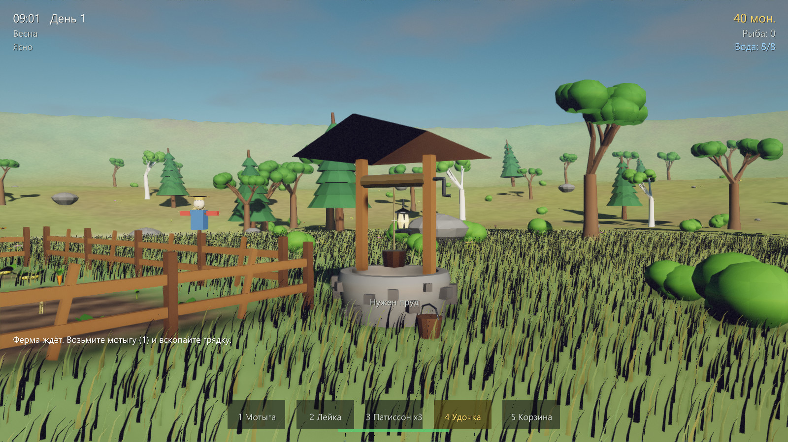 | 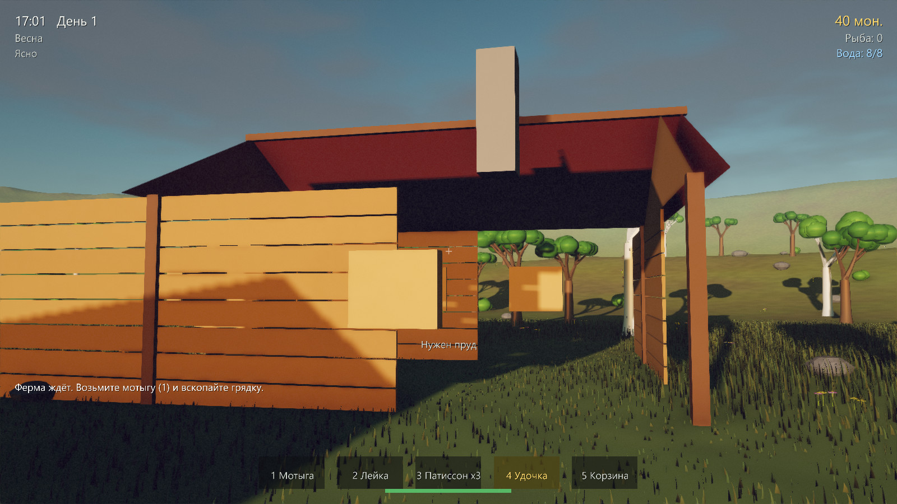 |
| **Колодец** | **Дом** |
| 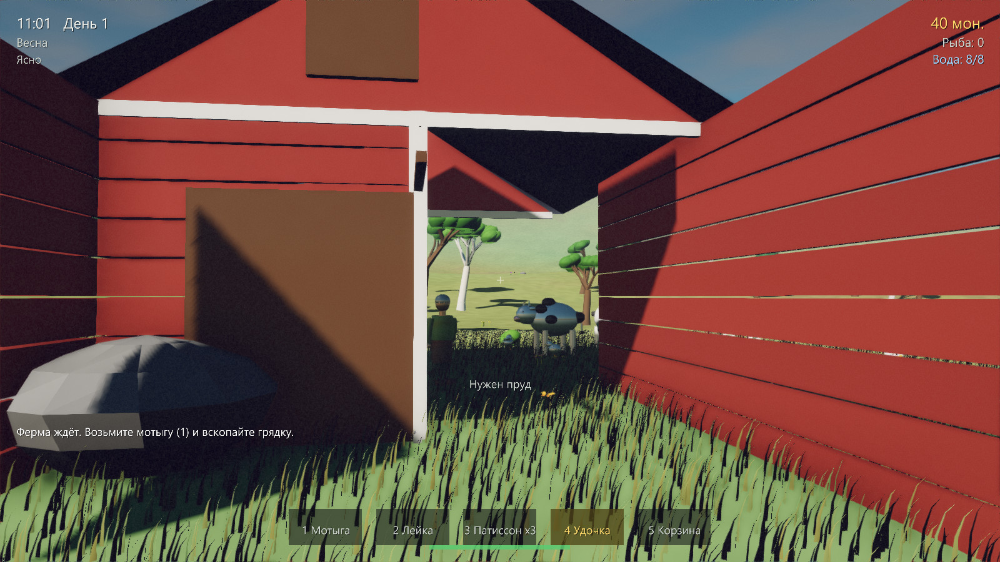 | 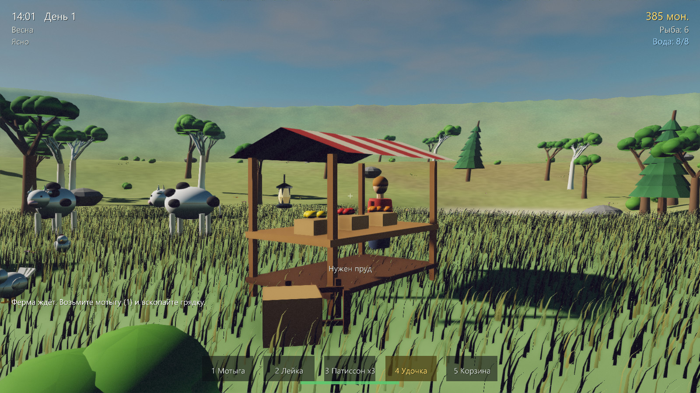 |
| **Амбар, коровы и куры** | **Прилавок — продажа урожая** |
| 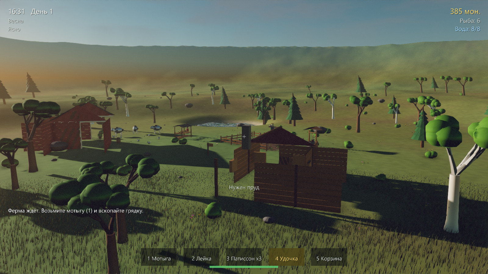 | 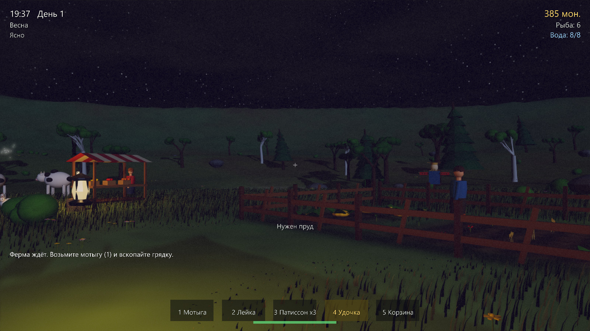 |
| **Вид с холма** | **Закат** |
| 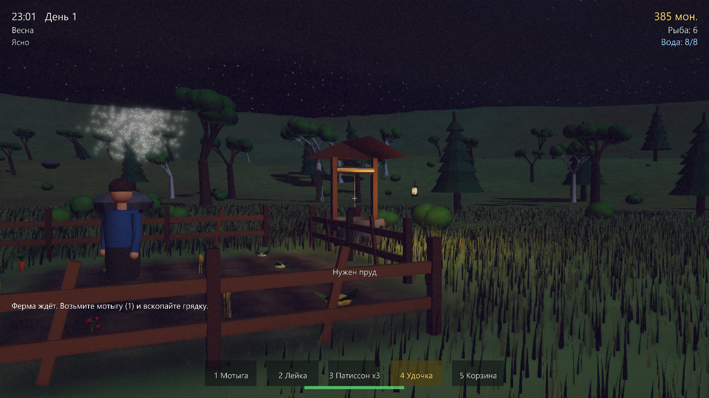 | 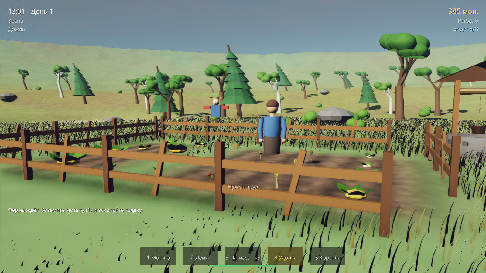 |
| **Ночь: звёзды и фонари** | **Дождь** |
| 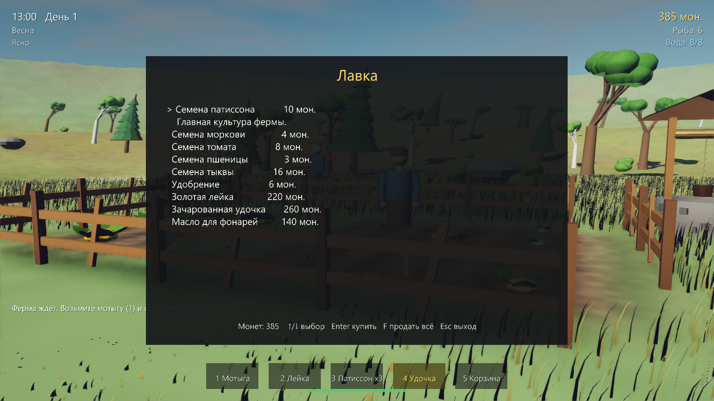 | 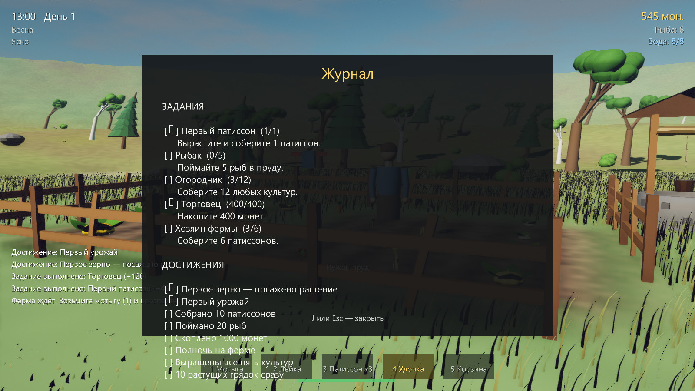 |
| **Лавка** | **Журнал: задания и достижения** |
| 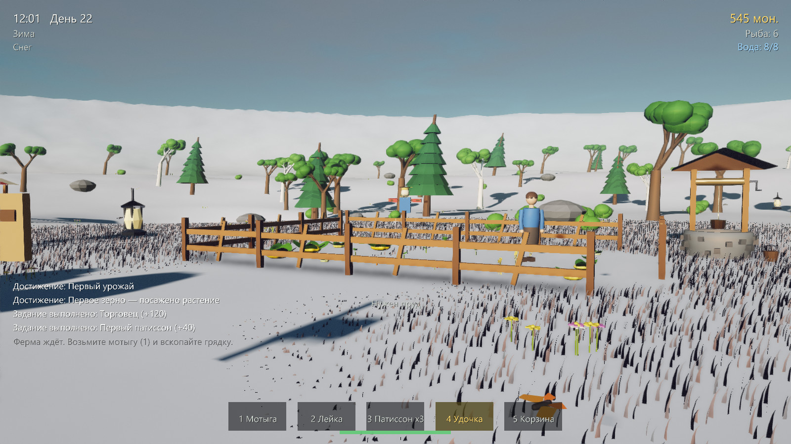 | 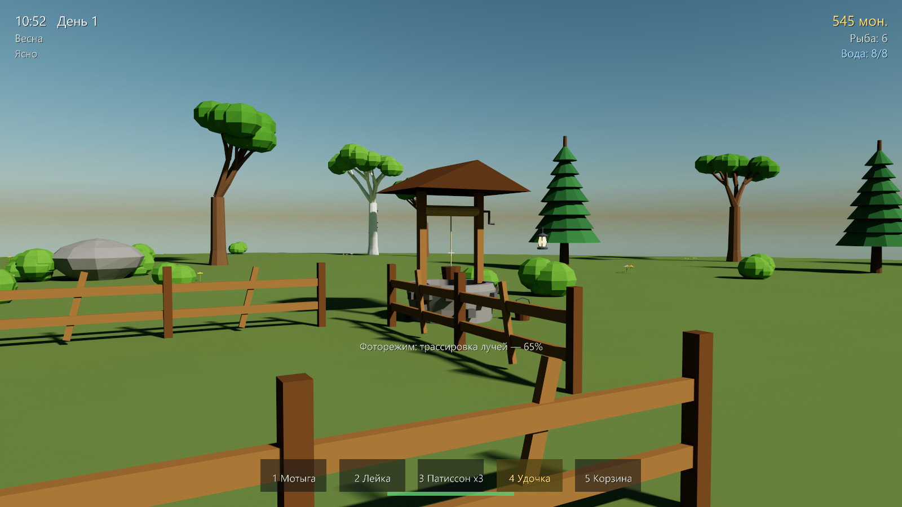 |
| **Зима** | **Фоторежим: та же сцена, трассировка лучей** |

---

## 🚀 Запуск

```bash
pip install -r requirements.txt
python -m patisson2
```

Всё. **Ресурсы не нужно нигде скачивать** — все 3D-модели лежат в репозитории
(`assets/models`, ~7 МБ), а земля, трава, вода, небо и облака генерируются
кодом. Это главное отличие от 1.0, где игре требовался установщик на 650 МБ.

Пресеты качества:

```bash
python -m patisson2 --low
python -m patisson2 --ultra
python -m patisson2 --fullscreen
```

Пересобрать модели после правок в генераторе:

```bash
python -m patisson2.tools.make_assets
```

Снять скриншоты (игра рендерится offscreen, окно не нужно):

```bash
python -m patisson2.tools.shots
```

### Требования

Python 3.10+, видеокарта с OpenGL 4.3. Разрабатывалось и проверялось на
GeForce RTX 3070 Laptop (OpenGL 4.6): около 40–50 fps в 1280×720 на пресете по
умолчанию. Если тормозит — `--low` (без SSAO и лучей солнца, тени 1024, травы
меньше).

---

## 🎮 Управление

| Действие | Клавиша |
|----------|---------|
| Движение / бег / прыжок | `W` `A` `S` `D` / `Shift` / `Space` |
| Осмотреться | мышь |
| Действие инструментом | `E` или ЛКМ |
| Удобрить грядку | ПКМ |
| Инструменты | `1` мотыга · `2` лейка · `3` семена · `4` удочка · `5` корзина |
| Сменить культуру | `Q` или колесо мыши |
| Лавка | `T` |
| Журнал (задания, достижения) | `J` |
| Продать всё (у прилавка) | `F` |
| Сохранить / загрузить | `F5` / `F9` |
| Фоторежим (трассировка лучей) | `P` |
| Показать/скрыть интерфейс | `F1` |
| Пауза | `Esc` |

---

## 🌱 Что нового по сравнению с 1.0

### Движок и графика

Всё написано с нуля на Panda3D + GLSL 4.60, без готовых пайплайнов:

- **PBR-освещение** (Cook-Torrance GGX) с корректным ambient-членом (split-sum).
- **Атмосфера с однократным рассеянием** (Рэлей + Ми) считается каждый кадр в
  маленькую равнопромежуточную таблицу неба. Из неё берётся и рассеянный свет,
  и воздушная перспектива — поэтому освещение сцены физически согласовано с тем
  небом, которое видно в кадре, в любое время суток.
- **Тени солнца**: карта 4096², PCF, смещение вдоль нормали, кадр следует за
  игроком и привязан к сетке текселей (тени не «плывут» при ходьбе).
- **Постобработка**: SSAO, bloom, объёмные лучи солнца, тонемаппинг ACES,
  цветокоррекция, виньетка, зерно, FXAA.
- **Процедурный ландшафт**: сетка сгущается к центру, поэтому у фермы
  треугольники метрового масштаба, а по краю мира поднимаются холмы — границы
  карты не видно.
- **Трава на GPU**: одна травинка, ~420 000 инстансов, позиция, наклон, размер и
  цвет каждой считаются в вершинном шейдере из номера инстанса. Трава знает
  высоту земли, уклон, воду и вскопанные грядки.
- **Вода**: волны Герстнера, френелевское отражение неба, поглощение по реальной
  глубине (читается высота дна), каустики, пена у берега.
- **Сутки и времена года**: положение солнца считается по часовому углу и
  склонению, зимой день короче. Небо, цвет света, экспозиция, цвет травы и
  деревьев следуют за сезоном.

### 🔦 Фоторежим: настоящая трассировка лучей

Клавиша **`P`**. Игра снимает геометрию сцены прямо из графа, строит по ней BVH,
загружает всё в видеопамять и запускает **compute-шейдер, который трассирует
пути** — с мягкими тенями от солнечного диска, глобальным освещением на
несколько отражений и русской рулеткой. Картинка накапливается прогрессивно,
пока не станет чистой (обычно несколько секунд).

Это не постэффект «под RTX», а честный path tracer: то, что растеризатор
приближает (SSAO, тени из карты, ambient), здесь считается по-настоящему.
Нужен OpenGL 4.3+ с compute-шейдерами; на RTX 3070 сцена из ~260 000
треугольников доходит до чистой картинки примерно за 5 секунд.

### Мир

- 38 моделей, **все сгенерированы кодом** (`patisson2/tools/make_assets.py`):
  дом, амбар, колодец, прилавок, забор, пугало, ящики, бочки, фонари, деревья
  четырёх видов, кусты, камни, камыш, кувшинки, цветы, куры, корова, кот,
  бабочки, рыба, три жителя и патиссон на четырёх стадиях роста.
- **Живность**: куры бродят у амбара, коровы пасутся, кот гуляет у дома,
  бабочки летают над грядками.
- **Три жителя** с распорядком дня: Богдан работает на грядках, потом стоит за
  прилавком и уходит домой спать; Марина торгует и ходит рыбачить; Пётр кормит
  кур и пасёт коров. С каждым можно поговорить.
- **Погода**: ясно, облачно, дождь, снег. В дождь грядки поливаются сами.

### Игровой процесс

- **Пять культур** — патиссон, морковь, томат, пшеница, тыква. У каждой свои
  сезоны, скорость роста, жажда и цена.
- **Грядки живут**: вода и питание убывают, без них растение вянет и погибает.
  Ухоженное растение даёт больше урожая.
- Копать грядки можно **где угодно** на ровной земле, а не только в одной точке.
- Колодец и пруд — источники воды; лейка имеет ёмкость, золотая лейка втрое
  больше.
- **Рыбалка** с ожиданием поклёвки и подсечкой.
- **Лавка** с семенами, удобрением и тремя улучшениями.
- **Задания и достижения** в журнале.
- **Сохранение** в `~/.patisson2/save.json`.

---

## 🗂 Структура

```
patisson2/
  app.py              игровой цикл, ввод, взаимодействия
  config.py           пресеты качества и настройки мира
  engine/
    pipeline.py       рендер-пайплайн: свет, тени, буферы, постобработка
    shaderlib.py      загрузка GLSL с #include и #define
    shaders/          все шейдеры (небо, сцена, ландшафт, трава, вода, пост)
  world/
    terrain.py        генератор высот и меша земли
    water.py          поверхность пруда
    grass.py          меш травинки + инстансинг
    world.py          сборка мира, маска вскопанной земли
    props.py          расстановка моделей, животные
    daynight.py       часы, солнце, времена года
  game/
    player.py         движение и взаимодействие
    farming.py        культуры, грядки, рост
    state.py          инвентарь, деньги, задания, достижения, сохранения
    npc.py            жители и их распорядок
  ui/hud.py           интерфейс
  tools/
    meshkit.py        процедурное моделирование + запись .glb
    make_assets.py    определения всех моделей
    shots.py          съёмка скриншотов
assets/models/        38 сгенерированных .glb
```

---

## 👤 Авторы

- **Богдан** — автор оригинальной Patisson Game. Идея, мир и всё, из чего
  выросла эта версия. Опубликовано с его разрешения, авторство сохраняется.
- **fedor655** — публикация на GitHub.
- Версия 2.0 — переработка движка и игрового процесса поверх его игры.

## 📄 Лицензия

[MIT](LICENSE) © 2025 Богдан.
